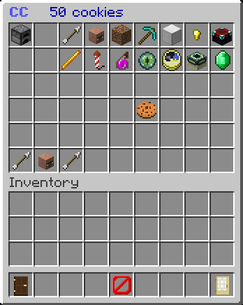

# Cookie Clicker

Cookie Clicker is an inventory game for the Spigot plugin [GameBox] inspired by the awesome [Cookie Clicker by dashnet](http://orteil.dashnet.org/cookieclicker/).

Since GameBox version 2, CookieClicker is distributed in the GameBox jar which is published on [Spigot](https://www.spigotmc.org/resources/37273/).

[GameBox]: https://github.com/NiklasEi/GameBox